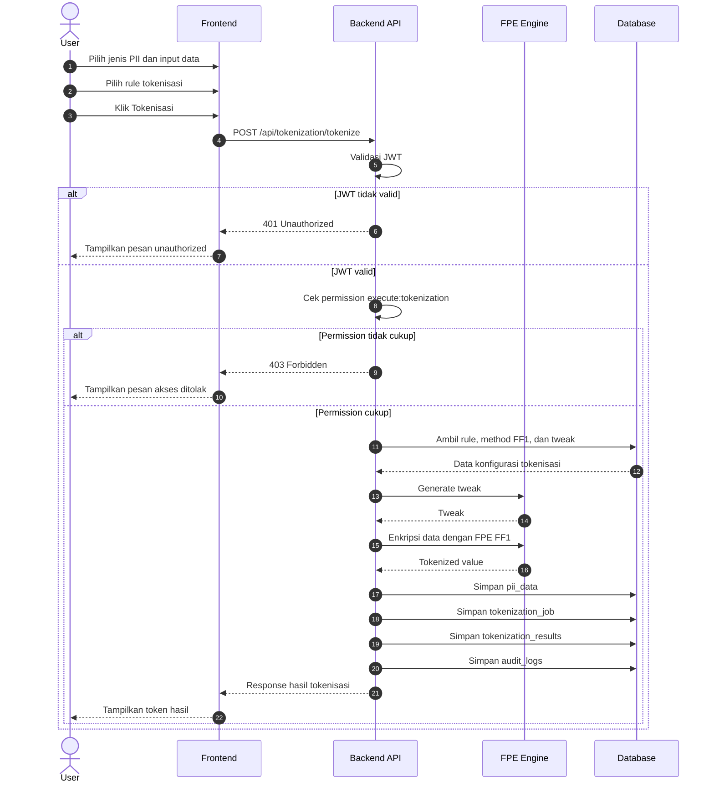

```mermaid
sequenceDiagram
    autonumber

    actor User
    participant FE as Frontend
    participant BE as Backend API
    participant FPE as FPE Engine
    participant DB as Database

    User->>FE: Pilih jenis PII dan input data
    User->>FE: Pilih rule tokenisasi
    User->>FE: Klik Tokenisasi
    FE->>BE: POST /api/tokenization/tokenize

    BE->>BE: Validasi JWT
    alt JWT tidak valid
        BE-->>FE: 401 Unauthorized
        FE-->>User: Tampilkan pesan unauthorized
    else JWT valid
        BE->>BE: Cek permission execute:tokenization

        alt Permission tidak cukup
            BE-->>FE: 403 Forbidden
            FE-->>User: Tampilkan pesan akses ditolak
        else Permission cukup
            BE->>DB: Ambil rule, method FF1, dan tweak
            DB-->>BE: Data konfigurasi tokenisasi

            BE->>FPE: Generate tweak
            FPE-->>BE: Tweak

            BE->>FPE: Enkripsi data dengan FPE FF1
            FPE-->>BE: Tokenized value

            BE->>DB: Simpan pii_data
            BE->>DB: Simpan tokenization_job
            BE->>DB: Simpan tokenization_results
            BE->>DB: Simpan audit_logs

            BE-->>FE: Response hasil tokenisasi
            FE-->>User: Tampilkan token hasil
        end
    end
```